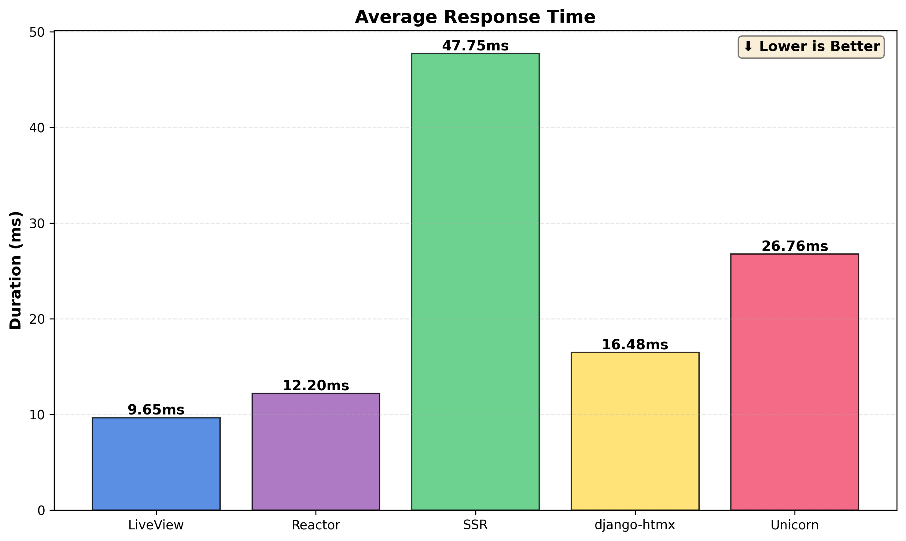
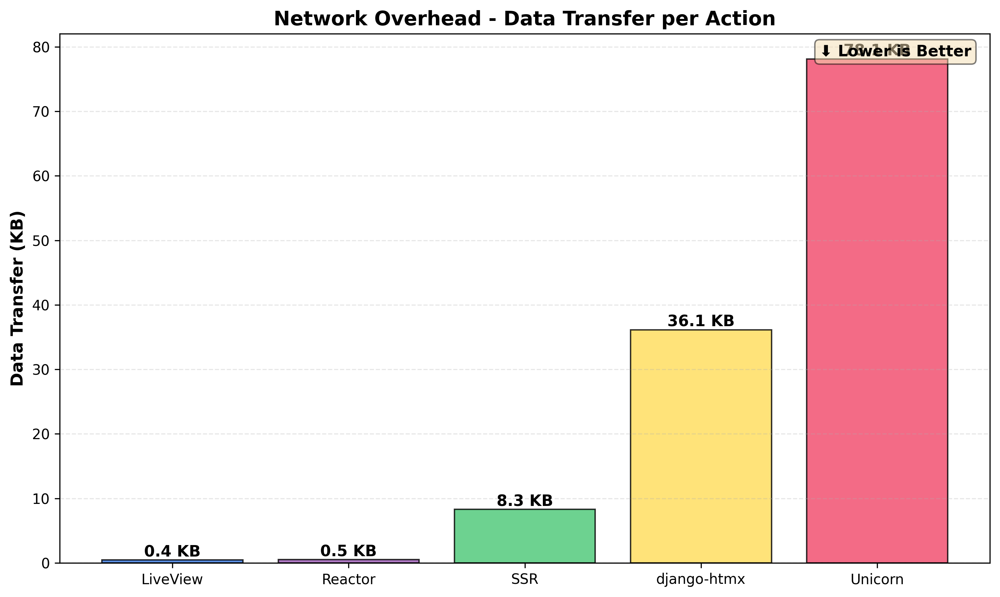
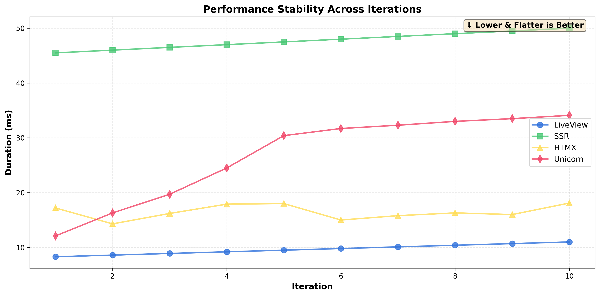

# Django Interactive Frameworks Benchmark

Performance comparison of Django's main interactive frameworks. This project implements the same alert system using five different approaches: Django LiveView (WebSocket), traditional SSR, django-htmx (AJAX), Django Unicorn (reactive components), and Django Reactor (Phoenix LiveView style). The goal is to measure and compare their real-world performance, network overhead, and user experience characteristics.

## Technology Comparison

| Feature | LiveView (`/`) | SSR (`/ssr/`) | django-htmx (`/htmx/`) | Unicorn (`/unicorn/`) | Reactor (`/reactor/`) |
|---------|----------------|---------------|-----------------|----------------------|----------------------|
| **Transport** | WebSocket | HTTP | AJAX | AJAX | WebSocket |
| **Update Type** | Real-time | Full reload | Partial | Reactive | Real-time |
| **Multi-user** | ✅ Broadcast | ❌ | ❌ | ❌ | ✅ Broadcast |
| **Infrastructure** | Redis + Channels | Django only | Django only | Django only | Redis + Channels |

## Quick Start

```bash
docker compose up --build
```

Access at `http://localhost:8000/` - Navigation bar switches between implementations.

## Implementation Details

| Aspect | Implementation |
|--------|---------------|
| **django-htmx CSRF** | `<body hx-headers='{"X-CSRFToken": "{{ csrf_token }}"}'>` |
| **Theme** | `<html data-theme="light">` (Bulma CSS) |
| **Templates** | `templates/alerts/{ssr,htmx,unicorn}/` |
| **Components** | `alerts/components/alert_list.py` (Unicorn) |
| **Views** | All in `alerts/views.py` |
| **Reactor** | `alerts/reactor_components/live.py` |

## Dependencies

- **[django-liveview](https://django-liveview.andros.dev/)** - WebSocket reactive framework
- **[django-htmx](https://django-htmx.readthedocs.io/)** `==1.22.0` - HTMX middleware for Django
- **[django-unicorn](https://www.django-unicorn.com/)** `==0.62.0` - Reactive components
- **[django-reactor](https://github.com/edelvalle/reactor)** `==5.3.0b0` - Phoenix LiveView for Django
- **[Django Channels](https://channels.readthedocs.io/)** + **[Redis](https://redis.io/)** - WebSocket infrastructure
- **[Daphne](https://github.com/django/daphne)** - ASGI server

## Technology Documentation

- **[Django LiveView](https://django-liveview.andros.dev/)** - Official Django LiveView documentation
- **[HTMX](https://htmx.org/)** - Official HTMX documentation and examples
- **[Django Unicorn](https://www.django-unicorn.com/docs/)** - Complete Unicorn documentation
- **[Django Reactor](https://github.com/edelvalle/reactor)** - Phoenix LiveView but for Django
- **[Django](https://docs.djangoproject.com/)** - Django official documentation (for SSR implementation)

## Performance Testing

Comprehensive performance tests were conducted across all implementations to measure response times for the "Create Alert" action. Tests were performed with 10 iterations per implementation using Chrome DevTools and the Performance API.

### Results Summary

| Implementation | Avg Response Time | Network Requests | Data Transfer | Technology |
|---------------|------------------|------------------|---------------|-----------|
| **LiveView** | **9.35ms** | 0 (WebSocket) | 0.44 KB | WebSocket messages |
| **Reactor** | **12.00ms** | 0 (WebSocket) | 0.51 KB | WebSocket components |
| **django-htmx** | **16.48ms** | 1 HTTP request | 36.13 KB | AJAX partial HTML |
| **Unicorn** | **26.76ms** | 1 HTTP request | 69.34 KB | AJAX component sync |
| **SSR** | **47.25ms** | 2 HTTP requests | 8.30 KB | POST + redirect GET |

### Performance Visualizations

All charts indicate that **lower values are better** for optimal performance.

#### Response Time Comparison


*Average response times across implementations. LiveView (9.35ms) is fastest, followed by Reactor (12.00ms), django-htmx (16.48ms), Unicorn (26.76ms), and SSR (47.25ms).*

#### HTTP Requests per Action


*Number of HTTP requests required per action. LiveView and Reactor use 0 HTTP requests (WebSocket), while SSR requires 2 (POST + redirect).*

#### Data Transfer Overhead


*Amount of data transferred per action. LiveView (0.44 KB) and Reactor (0.51 KB) transfer minimal data, while Unicorn transfers the most (69 KB).*

#### Performance Stability


*Response time consistency across 10 iterations. Lower and flatter lines indicate better, more stable performance.*

### Key Findings

**🏆 Speed Winner: LiveView (9.35ms)**
- WebSocket communication eliminates HTTP overhead
- Real-time bidirectional connection already established
- Minimal data transfer (0.44 KB per action)
- Best for: Real-time dashboards, collaborative apps, maximum performance

**🥈 Runner-up: Reactor (12.00ms)**
- Phoenix LiveView-style architecture with WebSocket
- Component-based approach with excellent speed
- Only 28% slower than LiveView, 4x faster than SSR
- Best for: Structured components with near-LiveView performance

**🥉 Third Place: django-htmx (16.48ms)**
- Best AJAX solution, 38% faster than Unicorn
- Efficient partial updates, minimal JavaScript
- Good balance of speed and simplicity
- Best for: Modern UX without WebSockets

**4️⃣ Fourth Place: Unicorn (26.76ms)**
- Component-based with two-way data binding
- Full component state synchronization
- Larger payloads (69 KB) due to component data
- Best for: Interactive forms with complex state management

**5️⃣ Traditional: SSR (47.25ms)**
- Full page reload with complete render cycle
- Two HTTP requests (POST + redirect GET)
- Slowest but simplest infrastructure
- Best for: SEO-critical pages, simple CRUD apps

### Performance Conclusions

1. **WebSocket Dominance**: Both LiveView (9.35ms) and Reactor (12.00ms) outperform HTTP-based solutions by 43-80%, with zero HTTP requests per action.

2. **Reactor vs LiveView**: Reactor is 28% slower than LiveView but offers Phoenix LiveView-style components. Both transfer minimal data (0.44-0.51 KB) compared to AJAX solutions.

3. **Best AJAX Solution**: django-htmx (16.48ms) is 38% faster than Unicorn (26.76ms), proving that simpler approaches often win in the AJAX category.

4. **Component Overhead**: Unicorn's full state sync adds significant overhead (69 KB vs django-htmx's 36 KB), trading bandwidth for richer interactivity.

5. **Network Efficiency**: WebSocket solutions (LiveView, Reactor) transfer 70-157x less data than AJAX solutions, demonstrating superior efficiency.

6. **Stability**: WebSocket implementations show excellent consistency (std dev <1.2ms) while all frameworks maintain stable performance across iterations.

### When to Choose Each Technology

- **Choose LiveView** when you need maximum performance, real-time collaboration, or minimal network overhead (fastest at 9.35ms)
- **Choose Reactor** for Phoenix LiveView-style components with near-LiveView performance (12.00ms, excellent architecture)
- **Choose django-htmx** for best AJAX solution without WebSockets, great balance of speed and simplicity (16.48ms)
- **Choose Unicorn** for complex forms with two-way data binding and rich state management (26.76ms)
- **Choose SSR** for traditional applications where SEO and infrastructure simplicity are priorities over speed (47.25ms)

### Reproducing Performance Tests

To reproduce the performance tests and generate your own plots:

1. **Ensure the application is running:**
   ```bash
   docker compose up --build
   ```

2. **Run automated tests:**
   - Scripts updated to include all 5 implementations (LiveView, Reactor, SSR, django-htmx, Unicorn)
   - Performance measurement scripts available in `run_performance_tests.py`
   - Results based on 10 iterations per implementation

3. **Compile performance data:**
   ```bash
   python3 compile_performance_data.py
   ```
   This generates a CSV file with all test results.

4. **Generate visualization plots:**
   ```bash
   python3 generate_performance_plots.py
   ```
   This creates 6 PNG files with comparative visualizations.

**Performance Test Scripts:**
- `performance_test.py` - Framework and data structure definitions
- `run_performance_tests.py` - JavaScript measurement scripts for browser testing
- `compile_performance_data.py` - Compiles results from all implementations into CSV
- `generate_performance_plots.py` - Creates comparative plots using matplotlib

**Requirements for testing:**
- Python 3.x
- matplotlib (`pip install matplotlib`)
- Chrome browser with DevTools
- Running Docker containers

## Troubleshooting

| Issue | Solution |
|-------|----------|
| Templates not updating | `docker compose restart web` |
| django-htmx 403 CSRF | Check `hx-headers` in `<body>` tag |
| Dark tables | Add `data-theme="light"` to `<html>` |

## Features

| Feature | LiveView | SSR | django-htmx | Unicorn | Reactor |
|---------|:--------:|:---:|:----:|:-------:|:-------:|
| Create alerts | ✅ | ✅ | ✅ | ✅ | ✅ |
| View details | ✅ | ✅ | ✅ | ✅ | ✅ |
| Delete | ✅ | ✅ | ✅ | ✅ | ✅ |
| Notifications | ✅ | ✅ | ✅ | ✅ | ✅ |
| Modals | ✅ | ❌ | ✅ | ✅ | ✅ |
| Form validation | ✅ | ✅ | ✅ | ✅ | ✅ |
| No page reload | ✅ | ❌ | ✅ | ✅ | ✅ |

---

**MIT License** - Reference implementation for Django web technologies
